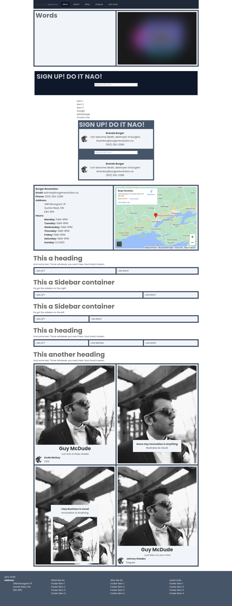

<h1 align="center">🚀 updraft-astro-tailwind</h1>

An extension of `astro-pwa-starter` defining simple common component types and a json based way of managing/separating Tailwind definitions. Aims to provide the lego pieces needed to service most needs of most simple websites with AstroJS + Tailwind3, while defining base components extensibly enough to simplify building webapps/web3 dApps of any complexity.

## Note: WIP

Core components are made, but where shared state between components is required (like nav), it hasn't been handled yet. Layout also needs work... should return to a single layout but was speedrunning and lazy. Both are included in a planned refactor/code cleanup phase.

## More detail

More detail about the starter this is based off can be found at [shawunchander/astro-pwa-starter](https://github.com/shaunchander/astro-pwa-starter), or at it's README which is [included here](./README-astro-pwa-starter.md) . This README will for now focus mostly on the set of components rolled atop that starter repo.

## Pages
- `main.astro`: the OG `astro-pwa-starter` mostly unblemished
- `index.astro`: a landing page not connected to the components (Affordable Audience is a potential project that will require a lot of canned/re-useable components to run with, which is what begat this project)
- `agency.astro`: the screenshot visible below. its not pretty... at all. but it is increasingly lego-like and could almost service most simple static website needs.

## Components 

### Containers 
- `Container`: generic div style container, used by nearly everything 
- `ContainerFull`: a simple extension enforcing full width
- `ContainerCentered`: a simple extension defining a centered box (super gross impl atm, @todo: fix) 
- `ContainerJustified`: a simple extension defining a justified div
- `Split`: a container comprised of 2 child containers with slot names "left" and "right". default is basis-1/2, but can be overrriden (see: Sidebars) 
- `Triplet`: a container comprised of 3 child containers with slot names "left", "middle" and "right". default is basis-1/3, but can be overrriden 
- `Quad`: a container comprised of 4 sub containers with slots named "tl", "tr", "bl", "br"
- `HookPlug`: a simple container comprised of 2 sub containers with no styles with slot names "hook" for the first and "plug" for the second. used quite a lot by other components
- `SidebarLeft`/`SidebarRight`:  simple extensions of the Split component that changes from basis-1/2 each to 1/4 and 3/4 to create a sidebar

### Tags/HTML Normative Components
- `Link`: simple link tag, supporting `external` boolean prop to add `target="_blank"`
- `Img`: simple image
- `Svg`: simple Svg component reducing use to just passing the data as a prop. Note: this only supports the one implementation of Svgs for the social icons it was originally made from. Will need to add more supported props to be actually useful.
- `List`: a simple list component, wrapping a list of `items` text in `ListItem` components
- `LinkList`: a simple extension supporting a list of `{url:'',text:'',external:bool}` conforming objects being wrapped in `LinkListItem` components
- `ListItem`: a simple li tag component. supports both the prop `text`, and passing components to its unnamed slot
- `LinkListItem`: an extension that formats each list item as a link. `url` and `external` must be set via props, but the content like ListItem supports both the `text` prop and an unnamed slot 

### Forms (will expand on later)
- `Form`, `Button`, `Submit`, `InputCheck`, `InputText`, `Label`:  I haven't tested form stuff much, but to avoid a lot of repetition... these are what they sound like
- `FieldText`: field text is made up of a `Label` and an `InputText` field
- `FormTextCapture`: needs work, but used by the `PlugCaptureForm`. intended to be a one liner form with input text + button... but has no button yet

### Base Complex Components
- `Footer`: footer component supporting the props: `address`, `list1`,`list2`,`list3` and `addressLast` (a bool flag that puts the contact on the right instead of left) 
- `Navbar`/`flattenMenu`: simple, opinionated navbar that uses `flattenMenu` to take in any defined Tailwind classes and compile them (needs work, not a fan of how implementation tied it is atm)
- `HeroSplit`: a simple extension of the Split that assumes you want an image in the right slot... not a great implementation but will likely get some improvements to keep a Hero component around

### Prefabs
- `Card`: leverages HookPlug components within, supporting the props `img`,`hook`, `plug`, `footer` and `super`/`sub`, which would be relative the hook
- `CardVisualHook`: supports the same props as `Card`, but makes the image a background image and places the state in a container positioned according to `styles/components/global/structure/visualcard.json`
- `PersonTitle` : simple component meant to place a name above a title/email/subtext
- `SocialSignature`: component made up of an image to the left of a `PersonTitle` component
- `ContactCard`: similar to the SocialSignature, but passes a list containing title, email and phone to the title slot (via the nameless slot)
- `Map`: a simple Google Map embed code taking in the `src` URL as a prop
- `Address`: component made to render an address from its `street`, `city`, `prov` and `postal` values. Note: prints "Address:" atm, but should optionally hide it.
- `Hours`: takes in an object with keys being the lowercase names of the week, and values being a string rep of the hours to print. 
- `ContactCardCompany`: similar idea to the `ContactCard`, but supports `address` and `hours` props as well, leveraging the above components if present
- `PlugCaptureForm`: meant to be a simple, single field form input. still a bit half baked with no button/not having tested any form components yet.

## Attributes/flattenClasses

`Attributes`: aims to define a list of valid HTML attributes that are permissible on HTML tags as to not spam arbitrary props into them. Atm its a function, but it should be rerolled as an interface because its way simpler. 

`flattenClasses`: aims to support the JSON based system of Tailwind rule management this project has ran with. These components follow a pattern of separating structure based rules from style based rules, while also supporting properties be overridden. The function expects: 
- a `keys` array, defining which fields to pluck out 
- `structure`, which would usually be loaded from `styles/components/global/structure` if a base component, or `styles/structure` if local to project
- `style`, which would usually be loaded from `styles/components/global/style` if a base component, or `styles/style` if local to project
- `props`, would usually just be passing the props, but could also be manipulated first. should override any structure/style rules, but have ran into cases where it hasn't, which is where the `uniqueTailwindClass` function stemmed from. Will need to more fully test both functions.

## @TODO: 
- fix the super broken-ness of some components on mobile... they know who they are...
- circle back to Layout to just support whatever slots/imported state necessary to keep it generalized
- change Attributes to an interface and update references to `atts = props as IAttributes` accordingly. potentially worth breaking up interfaces by tag type, but could get weird
- finish off navbar with required shared state components 
- improve Svg component to make it more generally useful
- expand features for other HTML tag normative components to make them more useful/flexible
- dive more into Tailwind themes and its build order's impact on how styles are built from JSON definitions
- lots more, including improving these docs
- fork my own repo to add Web3 components? not sure they need to be in a base made more for web2, but I'll want them so they'll be added... somewhere

## Example 

Its not pretty... but its _almost_ structured, which is what I'm after :P. Thanks Guy McDude, aka shawunchander, for the pwa-starter. Definitley helped hit the ground running playing with Astro (and Tailwind for that matter). Note: that is a real business, with really delicious burgers, but those emails are definitely fake. 

